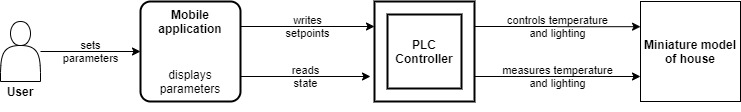
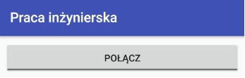
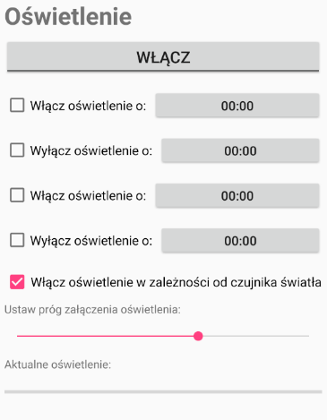
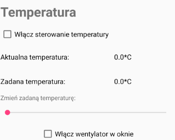

# Part of my bachelor's project - mobile application
The mobile application presented here is a part of my bachelor's thesis - Operator panel of industrial controller as a mobile application. The bachelor's thesis was written in 2018 under the supervision of Dr Michał Lower.

### General info
The mobile application presented here allows to control lighting and temperature in a miniature model of a house via PLC controller.

The user enters various parameters into the app. The app sends those parameters to the PLC controller and reads data about the current temperature inside the model and light intensity outside it. Based on the recived parameters, the PLC controller steers the light and temperature inside the model.

### Technologies
The project is created with:
* Android Studio
* Java
* MX Component for Android library

### User's interface and functionality of an app
Due to the written bachelor's thesis in Polish, the user's interface is in that laguage too.

After starting the app, the only possible operation is starting the connection with the PLC controller.

Pressing the button makes the app try to open the connection with Mitsubishi Electric FX5U PLC Controller with an IP address 192.168.22.150. In case of the connection being impossible, an appriopriate error message is shown.

After establishing the connection, control variables are downloaded from the PLC and the user gets access to the control options of light and temperature. The control varaibles are refreshed every second.

###### Light control
There are three light steering modes: manual, turning light on/off at a specific time and automatic.

Pushing the button "Włącz/Wyłącz" causes the light to be turned on/off.

By marking an appropriate checkbox the user can set up an option to turn the light on/off at specific time. The selection of time itself is being made by pressing an appropriate button next to the checkbox. The user can set two separate times for turning the light on/off.

The last option of controlling the light is the automatic mode. The user can use upper sliderbar to set up threshold of light intensity. If the light intensity (shown in lower sliderbar) is below the set up threshold, the light will be turned on. Otherwise the light will be off.

The automatic mode is mutually exclusive with the other two options, they cannot be used at the same time.

###### Temperature control

To control the temperature the user has two options: turn on/of fan in the model window and turn on/off the temperature control. 

The current temperature inside the model is shown here. Below, the set temperature is shown. It is chosen by the user via slidebar.